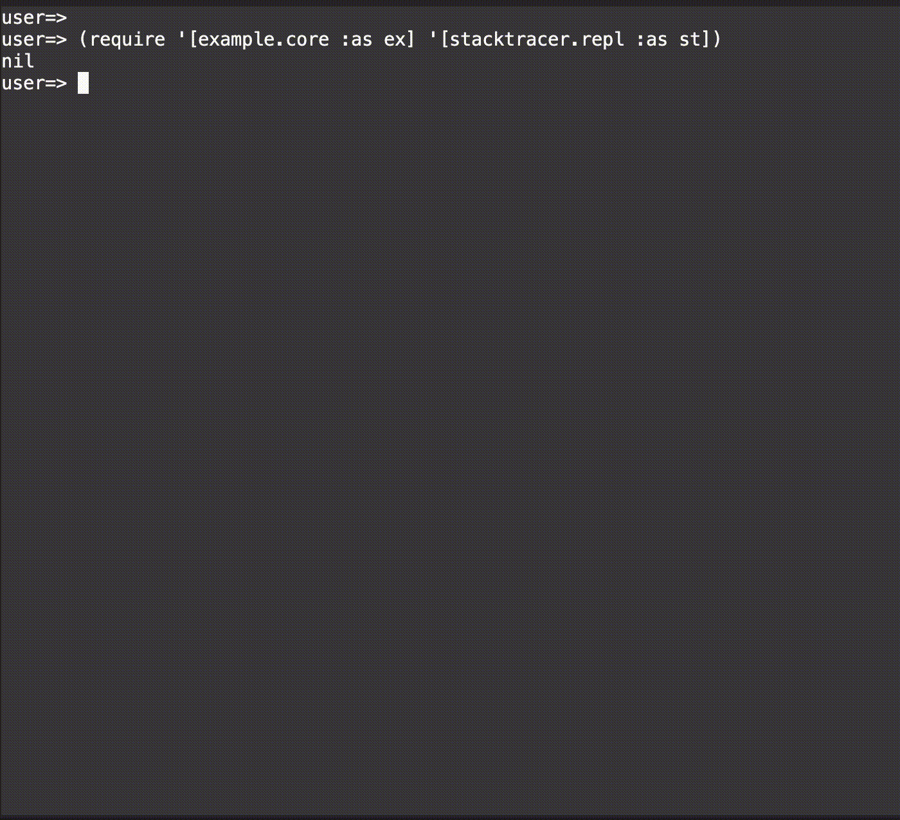

# stacktracer

A small development utility to print stack trace with code context

## Usage

FIXME

## License

Copyright © 2021 Shogo Ohta

Distributed under the Eclipse Public License version 1.0.
